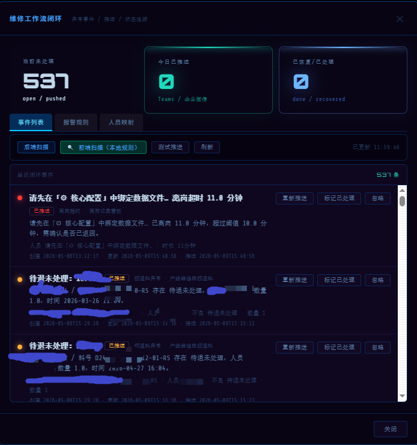
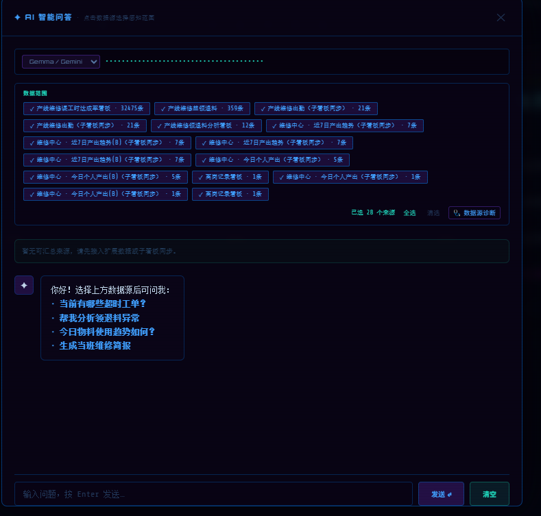
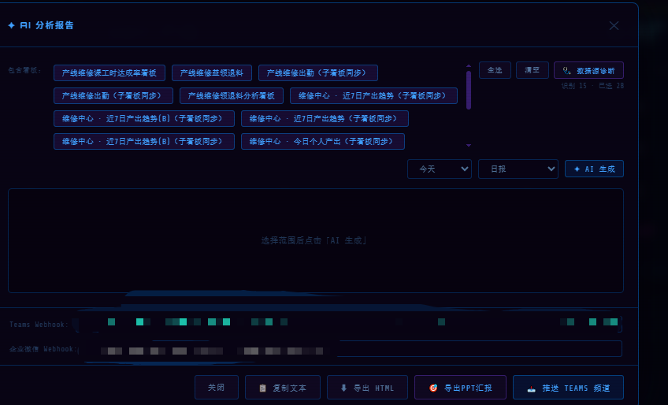

# 真实落地佐证（生产环境 · 已脱敏）

> **用途**：参赛「真实影响力」维度佐证 —— 证明本维修 Agent 方案已在真实电子厂产线落地运行。
> **模型口径**：生产环境为 **Gemini 2.5 Flash（ADK）**；参赛版为 **Gemma 4**，二者独立、不混用，详见《技术报告》第 9 节。
> ⚠️ **脱敏要求**：所有截图须脱敏后放入 `docs/evidence/`，**不得出现**真实工单号、料号、单号、人员真实姓名 / 拼音 / 工号、Webhook 地址、内网路径 / 盘符 / IP。

## 一、落地规模（脱敏）

| 维度 | 规模 |
|---|---|
| 接入数据源 | 28 个看板 / 数据源同步 |
| 日处理数据量 | 维修明细 3 万+ 条 / 日 |
| 异常闭环 | 单日 500+ 条工单异常自动分级（P0–P3）并推送闭环 |
| 推送渠道 | Microsoft Teams、企业微信 |

## 二、佐证截图（脱敏后放入 `docs/evidence/`）

| # | 文件名 | 证明什么 | 已脱敏核对项 |
|---|---|---|---|
| 1 | `工单闭环.png` | 数百条工单异常自动分级 + 推送闭环（已推送 / 已处理 / 已恢复） | 工单号、料号、人员姓名 ✓ |
| 2 | `数据规模.png` | 28 数据源同步、3 万+ 条 / 日 | 真实明细仅留量级数字 ✓ |
| 3 | `推送能力.png` | Teams / 企业微信真实推送 | 两个 Webhook 地址 ✓ |

